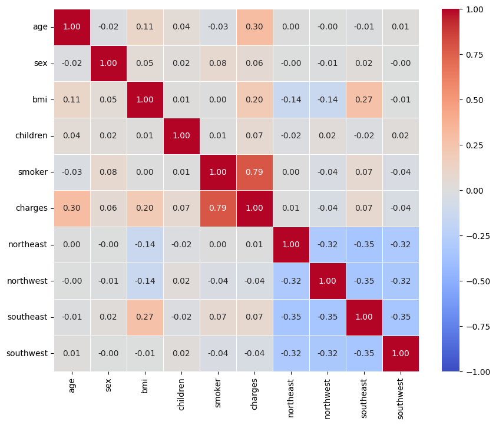
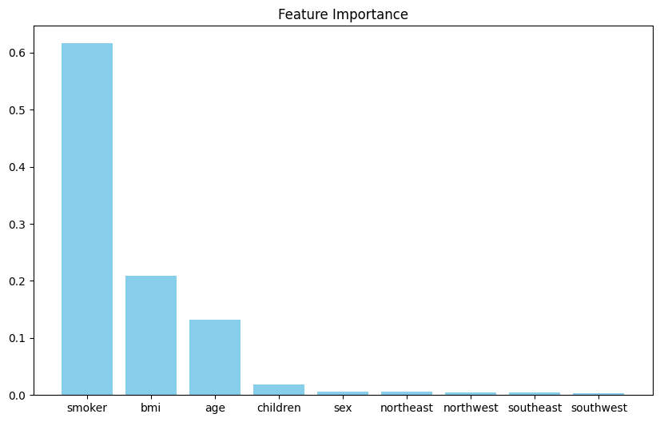
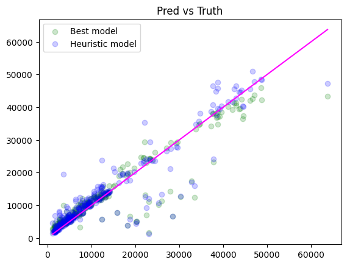

## Random Forest regressor to estimate the health insurance premiums

This Jupyter notebook demonstrates the use of Random Forest to estimate health insurance premiums for customers based on various variables such as location, age, smoking status, gender, etc.
It also uses a grid search approach to fit the model to the data.
 

## Requirements
- Python 3.10+
- Jupyter Notebook/Lab
- Required Python packages:
  - pandas
  - matplotlib
  - seaborn
  - scikit-learn


The dataset link: https://www.kaggle.com/datasets/teertha/ushealthinsurancedataset


## Project Structor
```bash
project_root/
│
├── assets/  
├── data/
│   └── insurance.csv
│   
├── regressor.ipynb  
├── README.md
└── requirements.txt
```

## Usage
1. Create a virtul env:

```bash
python -m venv my_env
source .my_env/bin/activate
```

2. Install the required dependencies:

```bash
pip install -r requirement.txt
```

3. Run the jupyter notebook (regressor.ipynb) in colab or locally in VSCode. 


### Sample plots at the end of the jupyer notebook run


<table>
  <tr>
    <td>
      <p>Parallel plot</p>
      
    </td>
    <td>
      <p>Importance plot</p>
      
    </td>
    <td>
      <p>Regression result</p>
      
    </td>
  </tr>
</table>

